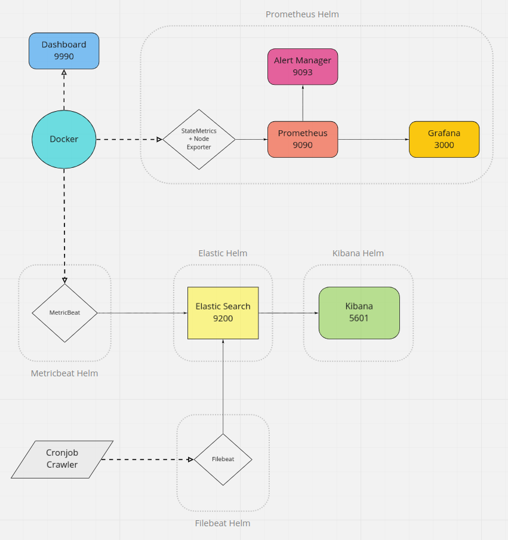

# Vacation Rental Analyzer
VRA is a crawler that can get information on room vacancy from a list of Airbnb room numbers, then, ideally, analyze this data through the use of microservices such as Kibana. Helm artifacts were used for most of the structure of the project.

Project started as docker-compose, became a GKE cluster with manually configured builds, which then were readapted into custom Helm charts, then resignated into using Helm artifacts with custom values due to intercommunication issues, but lost a considerable amount of control in the way.

# Architecture


# Setup

1. Prepare a Docker environment with kubectl and helm

2. Execute the script:  

    ```./setup.sh```

3. Access Kibana on http://localhost:5601/

4. Prepare the metrics and go to the Discover page

# Helms

Project uses a local version of [kube-prometheus-stack](https://artifacthub.io/packages/helm/prometheus-community/kube-prometheus-stack/10.0.1) with Prometheus, Grafana, AlertManager and more.  

Helm artifacts from [elastic](https://helm.elastic.co) for Elastic Search, Kibana, FileBeat and MetricBeat also were used.